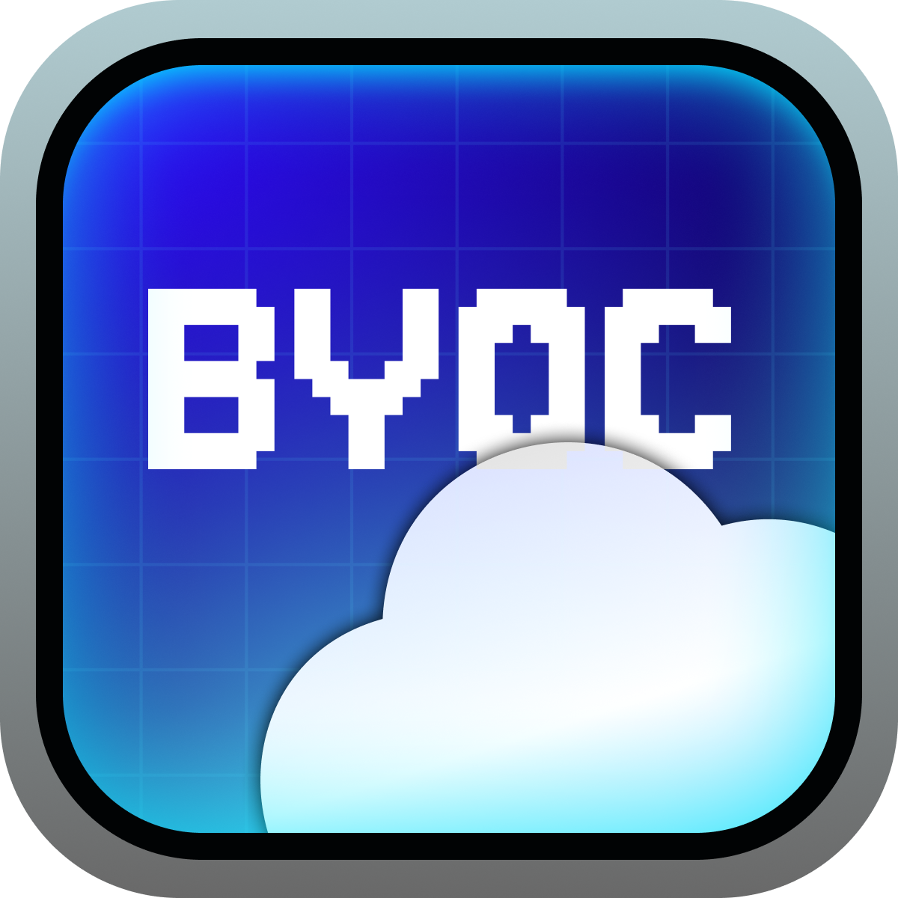

# Awesome BYOC 

> A curated list of Bring Your Own Cloud (BYOC) tools and resources.

**BYOC (Bring Your Own Cloud)** is a deployment model where software runs in *a customer's* cloud account instead of a vendor's shared environment. This provides customer's data sovereignty, compliance control, cost transparency, and avoids vendor lock-in.

 

**[View the website](https://www.awesomebyoc.com)**

## Contents

- [BYOC Tools](#byoc-tools)
  - [Databases](#databases)
  - [Streaming](#streaming)
  - [Observability](#observability)
  - [Data Integration](#data-integration)
  - [Storage](#storage)
  - [Dev Platforms](#dev-platforms)
  - [Apps](#apps)
  - [Internal Tools](#internal-tools)
  - [AI](#ai)
  - [Bring Your Own Cloud Platforms](#bring-your-own-cloud-platforms)

## BYOC Tools

### Databases

- [Aiven](https://aiven.io/docs/platform/concepts/byoc) - Managed open source data infrastructure with BYOC deployment option for PostgreSQL, Kafka, and more.
- [Bonsai](https://bonsai.io/bring-your-own-cloud) - Managed Elasticsearch and OpenSearch deployed in your own cloud account.
- [CelerData](https://docs.celerdata.com/byoc/) - Managed StarRocks analytics database deployed in your own cloud account.
- [Chroma](https://www.trychroma.com/) - Fast, serverless search platform supporting vector, full-text, regex, and metadata search. ([Source Code](https://github.com/chroma-core/chroma))
- [ClickHouse](https://clickhouse.com/cloud/bring-your-own-cloud) - Real-time OLAP database for analytics with BYOC deployment. ([Source Code](https://github.com/ClickHouse/ClickHouse))
- [CockroachDB](https://www.cockroachlabs.com/product/cloud/bring-your-own-cloud/) - Distributed SQL database built for global scalability, strong consistency, and survivability. ([Source Code](https://github.com/cockroachdb/cockroach))
- [DragonflyDB](https://www.dragonflydb.io/docs/cloud/enterprise) - Redis-compatible in-memory database with managed BYOC enterprise deployment. ([Source Code](https://github.com/dragonflydb/dragonfly))
- [Imply](https://imply.io/imply-enterprise-hybrid/) - Managed Apache Druid analytics database deployed in your own AWS VPC.
- [LanceDB](https://lancedb.com/docs/enterprise/deployment/) - Vector database with BYOC enterprise deployment for high-performance AI workloads. ([Source Code](https://github.com/lancedb/lancedb))
- [Pinecone](https://docs.pinecone.io/guides/production/bring-your-own-cloud) - Vector database purpose-built for AI applications requiring similarity search at scale.
- [PlanetScale](https://planetscale.com/docs/plans/managed) - MySQL-compatible serverless database platform with managed BYOC deployment.
- [Qdrant](https://qdrant.tech/hybrid-cloud/) - Vector database with Hybrid Cloud deployment on your own infrastructure. ([Source Code](https://github.com/qdrant/qdrant))
- [Redis](https://redis.io/docs/latest/operate/rc/subscriptions/bring-your-own-cloud/) - Managed Redis in your own AWS account with full data plane control.
- [SingleStore](https://www.singlestore.com/blog/singlestore-byoc-on-aws/) - Distributed SQL database optimized for real-time analytics and transactions in a single platform.
- [turbopuffer](https://turbopuffer.com/docs/architecture) - Serverless {vector, full-text} search built from first principles on object storage.

### Streaming

- [Redpanda](https://www.redpanda.com/product/bring-your-own-cloud-byoc) - Kafka-compatible streaming platform with 10x lower latency, no ZooKeeper dependency. ([Source Code](https://github.com/redpanda-data/redpanda))
- [WarpStream](https://www.warpstream.com/bring-your-own-cloud-kafka-data-streaming) - Kafka-compatible streaming that runs entirely in your cloud with zero inter-zone networking costs.

### Observability

- [Chronosphere](https://chronosphere.io) - Cloud-native observability platform with BYOC data plane for telemetry pipelines. ([Docs](https://docs.chronosphere.io/))
- [Datadog](https://www.datadoghq.com) - BYOC log management with indexing and search running in your own Kubernetes cluster. ([Docs](https://docs.datadoghq.com/cloudprem/introduction/))
- [Dynatrace](https://www.dynatrace.com) - Full-stack observability deployed and managed by Dynatrace in your own cloud. ([Docs](https://docs.dynatrace.com/managed))
- [Grafana](https://grafana.com/products/bring-your-own-cloud-byoc/) - Open source analytics and visualization platform for metrics, logs, and traces. ([Source Code](https://github.com/grafana/grafana))
- [Groundcover](https://www.groundcover.com/blog/why-byoc-is-the-future) - Cloud-native observability using eBPF for zero-instrumentation monitoring in Kubernetes.
- [Honeycomb](https://www.honeycomb.io/blog/honeycomb-launches-new-private-cloud-offering-address-security-compliance-cost-concerns) - Observability platform for debugging distributed systems with high-cardinality data exploration.
- [Last9](https://last9.io) - Managed Prometheus-compatible monitoring in your own cloud. ([Docs](https://last9.io/docs/))
- [SigNoz](https://signoz.io) - Open source full-stack observability with vendor-managed BYOC deployment. ([Docs](https://signoz.io/docs))

### Data Integration

- [Airbyte](https://airbyte.com) - Managed ELT connector platform with data plane running in your own cloud. ([Docs](https://docs.airbyte.com/platform/deploying-airbyte))
- [AnswerLayer](https://getanswerlayer.com) - Generative semantic layer for natural language analytics on sensitive data.
- [Estuary](https://docs.estuary.dev/private-byoc/byoc-deployments/) - Real-time ETL platform with CDC capabilities for streaming data integration. ([Source Code](https://github.com/estuary/flow))
- [Fivetran](https://www.fivetran.com) - Managed ELT pipelines with data-plane agent running in your own VPC. ([Docs](https://fivetran.com/docs/deployment-models/hybrid-deployment))
- [Matillion](https://www.matillion.com) - Cloud ELT platform with customer-managed agents deployed in your own cloud VPC. ([Docs](https://docs.matillion.com/data-productivity-cloud/security/docs/deployment-options/))
- [Snowflake Openflow](https://www.snowflake.com/en/blog/openflow-byoc-data-integration/) - BYOC data integration that moves data into Snowflake while keeping compute in your environment.

### Storage

- [Tigris](https://www.tigrisdata.com/docs/) - Globally distributed S3-compatible object storage service that works with any compute provider.

### Dev Platforms

- [E2B](https://e2b.dev/enterprise) - Open source sandboxed cloud environments for AI-powered code execution and agents. ([Source Code](https://github.com/e2b-dev/E2B))
- [LangChain](https://langchain.com) - Observability and evaluation platform for LLM applications. ([Docs](https://docs.langchain.com/langsmith/self-hosted))
- [Northflank](https://northflank.com/) - Dev platform for running databases, agents, GPU workloads, and jobs. ([Docs](https://northflank.com/docs))
- [Okteto](https://www.okteto.com/) - Remote Development Environments for Humans and Agents.
- [Ona](https://ona.com) - Mission control for software projects and AI agents.
- [Rivet](https://rivet.dev/) - Infrastructure for stateful AI agents with Actor-based runtime. ([Source Code](https://github.com/rivet-gg/rivet))

### Apps

- [Glean](https://www.glean.com) - Enterprise Work AI search and assistant platform managed in your own cloud. ([Docs](https://docs.glean.com/get-started/build/about-self-hosted))
- [Knovos](https://www.knovos.com/) - Legal information management and eDiscovery platform. ([Docs](https://www.knovos.com/company/byc/))

### Internal Tools

- [Retool](https://retool.com) - Low-code internal tool builder with vendor-managed deployment in your AWS VPC. ([Docs](https://docs.retool.com/self-hosted/retool-managed/concepts/architecture))
- [Superblocks](https://www.superblocks.com) - Internal tools platform with vendor-managed data plane in your cloud VPC. ([Docs](https://docs.superblocks.com/enterprise/hybrid-architecture/overview))

### AI

- [Baseten](https://www.baseten.co) - ML model inference platform running in your VPC, managed by Baseten. ([Docs](https://www.baseten.co/deployments/baseten-self-hosted/))
- [Braintrust](https://www.braintrust.dev) - LLM evals platform with data plane running in your own cloud VPC. ([Docs](https://www.braintrust.dev/docs/guides/self-hosting))
- [Cohere](https://cohere.com) - Enterprise LLM platform with model containers deployed in your own cloud. ([Docs](https://docs.cohere.com/docs/private-deployment-overview))
- [Devin](https://devin.ai/) - Autonomous AI software engineer with enterprise BYOC deployment options.
- [Tabnine](https://www.tabnine.com) - AI code assistant deployed in your VPC with Tabnine managing setup and updates. ([Docs](https://docs.tabnine.com/main/administering-tabnine/private-installation))
- [Together AI](https://www.together.ai) - LLM inference and fine-tuning platform deployed in your own VPC. ([Docs](https://docs.together.ai/docs/deployment-options))

### Bring Your Own Cloud Platforms

- [Distr](https://distr.sh/) - Open Source Distribution Platform for BYOC, on-prem and self-managed deployments. ([Source Code](https://github.com/distr-sh/distr))
- [Nuon](https://docs.nuon.co/get-started/introduction) - Control Plane and Runner driven BYOC platform for deploying software to customer cloud environments and on-premises infrastructure.
- [Replicated](https://www.replicated.com/) - Managed BYOC platform for vendors to manage the lifecycle of installing on a customer's cloud.

**Common Patterns**

| Pattern                    | Description                                                                       |    
| -------------------------- | --------------------------------------------------------------------------------- |    
| Control Plane / Data Plane | Vendor hosts management UI, your cloud runs the workloads.                        |    
| Agent-Based                | Lightweight agent in your environment connects outbound to vendor services.       |    
| Full Self-Hosted           | Everything runs in your environment, supporting air-gapped deployments.           |

## Contributing

Contributions welcome! See [CONTRIBUTING.md](CONTRIBUTING.md) for how to add a tool.
